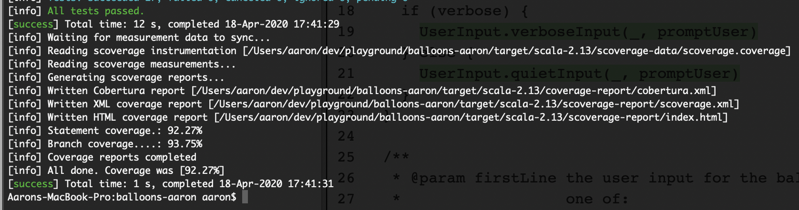
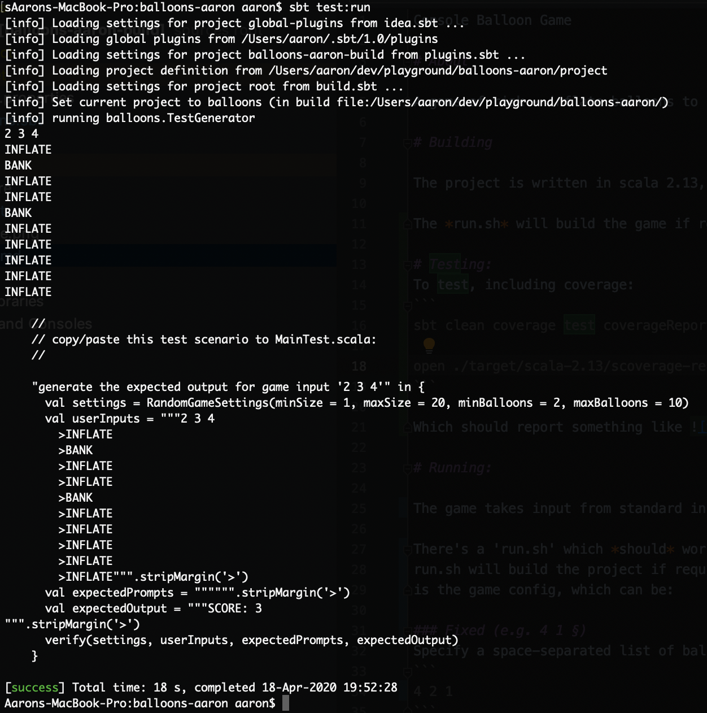

Console Balloon Game

# About

A game of risk - inflate balloons to increase your score, but be sure to 'bank' before they pop!

# Building

The project is written in scala 2.13, built with sbt.

The *run.sh* will build the game if required.

# Testing:
To test, including coverage:
```
sbt clean coverage test coverageReport

open ./target/scala-2.13/scoverage-report/index.html
```

Which should report something like 

One neat feature is that you can generate and save tests by playing the game.
If you run:
```
sbt test:run
```
The the game will output a ScalaTest snippet which you can copy/paste/optionally edit into the MainTest.scala:

Like 


# Running:

The game takes input from standard input. 

There's a 'run.sh' which *should* work out-of-the-box if you have *sbt* installed.
run.sh will build the project if required, otherwise it'll launch the game, which assumes the first input
is the game config, which can be:

### Fixed (e.g. 4 1 §)
Specify a space-separated list of balloon sizes:
```
4 2 1
```
to produce a game with three balloons of size four, two and one

```
sbt run 4 2 1
```

### Random (e.g. r)

For a random game (e.g. single-player), just enter 'r' to have a random number of balloons of different sizes.

NOTE: to change the min/max number of balloons and sizes you can set the following environment variables:
 * minBal

This is controlled in code via 'RandomGameSettings':
```
export minSize = 3
export maxSize = 10
export minBalloons=4
export maxBalloons=8
```

```
sbt run r
```

### Random Consistent (e.g. r123)

Like random games, but add a seed value after 'r':

```
sbt run r10
```

This will play game 10, which will be consistent across multiple runs for the same RandomGameSettings.

This way multiple players can play 'game 1234' w/o any one person knowing what the balloons are ahead of time.


# Approach

This was initially done as a small demo for the logic behind a zero-dependency game, just based on a fixed input (e.g. running with the first input of 4 2 1).

## Phase One

The first pass was done as directed - a fixed set of balloon inputs and minimum console feedback.

I coded it up as folding over a 'game state' over a lazy sequence of game inputs.
e.g. something akin to this:

```
   sealed trait UserInput
   case object Bank extends UserInput
   case object Inflate extends UserInput

   val userInputs : Seq[UserInput] = LazyList.continually(StdIn.readLine()).map(parseInput)

   val finalState = userInputs.foldLeft(GameState()) {
   	  case (state, input) => state.update(input)
   }

   println(s"Score: ${finalState.score}")
```

That was super-simple, and (I thought) pretty easily testable. The tests were a little clunkier than I wanted though, as they had to set up a collection of fixed 'UserInput's for a game.

## Phase Two - fixed random games and generated tests
The game worked after phase one, and to my deligh my 9yr old daughter really enjoyed playing/testing it!  At this point I was at around the 2 hour mark, but given my daughter's (and my) interest, I wanted to keep going.

I wanted to play it with my daughter, and also wanted a way where we could both play the game w/o one of us knowing the balloon sizes, and yet still both be able to play the same random game. It would also be nice not to have to clear down the first line of input.

At this point I essentially started over, as I wanted to get rid of the fixed stream of user inputs.

I wanted to go from:
```
val userInputs : Seq[UserInput] = LazyList.continually(StdIn.readLine()).map(parseInput)
```

to something like:

```
sealed trait SomePreviousState
...

def userInput(previousState : SomePreviousState) : IO[UserInput] = ???
```

This way the user-feedback could offer a bit more back to the player (current balloon index, size, if there was a 'burst', etc).

I also had in mind the concept of integration tests. Most of my phase 1 tests would die w/ these changes, and I wanted to be able to play a game, visually verify the outputs were as expected for my inputs, and then just save/replay those test scenarios. In principal this should be pretty simple given the new approach, as I could just buffer the prompts and user responses.

At this point I'd probably bring in cats-effect or zio, but I really just needed an IO and State monad.
I also though briefly on Dan Spiewak's Free as in Monads talk where Daniel quickly created the Free monad in 15 minutes. And so that's what I did -- I pinched the 'Seed' from [my genetic algo demo](https://github.com/aaronp/countdown/src/main/scala) to use for fixed, purely functional random numbers and just wrote a basic balloons.fp.Task[A] to use for my IO monad.


With this in place, the code (perhaps apart from having to add the 'fp' package) got a lot simpler, and I'm pleased with how the 'TestGenerator' turned out. Basically you can run the equivalent of the Main entry point, but the output at the end is some test code which you can copy/paste into MainTest.scala to re-run test sessions.

I love stuff like that - I don't have to write (or read!) lots of test code, I let the main program logic do it for me just by capturing the inputs/outputs. It gets me great test end-to-end test coverage and let me delete unused code.

## Phase Three
At this point I'd want to turn this into a scalajs project and stick a noddy boostrap UI on it. It's really piqued my daughter's interest in coding, which was a plus, and I'm sure she's love seeing a growing balloon on a browser all the more!


